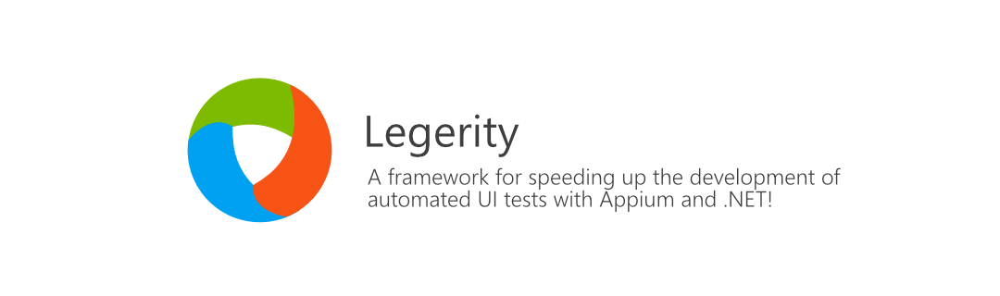

# Legerity

    

        
/ləˈdʒɛr ɪ ti/ (l<i>uh</i>-<b>jer</b>-i-tee)

    

    

        

            

                
<i>noun</i>

            

        

        <ol>
            <li>
                

                    

                        
physical or mental quickness; nimbleness;
                                agility.

                    

                

            </li>
        </ol>
    

Legerity is an automated UI testing framework for building maintainable tests quickly for Windows, Android, iOS, and Web applications with C#/.NET.

It simplifies the development by providing easy-to-use element wrappers for native app controls that allow developers to quickly get up and running with UI tests in no time.

Legerity also provides a best practice page object pattern for building UI tests with a maintainable structure. Together with native app control wrappers, Legerity provides the best experience for building maintainable UI automation with speed.

**[Discover what's new in Legerity](https://github.com/MADE-Apps/legerity/releases)**

## Features ⭐

- **AppManager**: A wrapper around the [Selenium WebDriver](https://github.com/SeleniumHQ/selenium) and [Appium WebDrivers](https://github.com/appium/appium-dotnet-driver) to simplify starting your UI tests. Supports running a single set of UI tests across multiple platforms, or browsers.
- **Page Object Pattern**: Provides a `BasePage` that can be used to create page objects associated with pages in your application that are easy to implement and maintain.
- **[Page Object Generator](tools/Legerity.PageObjectGenerator)**: A dotnet CLI tool that will automatically create page objects by understanding your application page files!
- **Element Wrappers**: Contains a collection of out-of-the-box wrappers for native UI elements that are easy to use with interactions.
- **Testing Frameworks**: Legerity is agnostic of .NET testing frameworks (e.g. NUnit, xUnit, MSTest, etc.) so you can work with what you know.
- **CI** - Legerity is also agnostic of host CI runner platforms (e.g. GitHub Actions, Azure Pipelines, etc.) and can be run anywhere.
- **Extendable**: [Legerity.Windows](https://www.nuget.org/packages/Legerity.Windows), [Legerity.Android](https://www.nuget.org/packages/Legerity.Android), [Legerity.IOS](https://www.nuget.org/packages/Legerity.IOS), [Legerity.Web](https://www.nuget.org/packages/Legerity.Web), [Legerity.MADE](https://www.nuget.org/packages/Legerity.MADE), [Legerity.Telerik.Uwp](https://www.nuget.org/packages/Legerity.Telerik.Uwp), [Legerity.WCT](https://www.nuget.org/packages/Legerity.WCT), and [Legerity.WinUI](https://www.nuget.org/packages/Legerity.WinUI) packages include out-of-the-box platform element wrappers for you to use. We also provide the [Legerity.Core](https://www.nuget.org/packages/Legerity.Core) for you to extend your UI components too.

## Documentation 📃

If you want to deep dive into the Legerity framework with details on how to use the features, you can browse the [documentation](https://made-apps.github.io/legerity/) for help getting up and running!

Our documentation includes usages examples, as well as API documentation for your technical reference.

## Installation 💾

Legerity is publicly available via NuGet. Each available package is detailed below.

For non-core platform controls, for example, WinUI or the Windows Community Toolkit, we're providing additional extension packages for you to take advantage of within your test projects.

| Package                                       | Downloads                                                 |
|-----------------------------------------------|-----------------------------------------------------------|
|  |  |
|  |  |
|  |  |
|  |  |
|  |  |
|  |  |
|  |  |
|  |  |
|  |  |
|  |  |
|  |  |

## Support Legerity 💗

As many developers know, projects like Legerity are built and maintained in spare time. If you find this project useful, please **Star** the repo and if possible, sponsor the project development on GitHub.

## Contributing 🚀

Looking to help build Legerity? Take a look through our [contribution guidelines](CONTRIBUTING.md). We actively encourage you to jump in and help with any issues!

## Building Legerity 🛠

Legerity is built using .NET Standard, taking advantage of the new SDK-style projects.

You can build the solution using Visual Studio with the following workloads installed:

- .NET desktop development
- .NET Core cross-platform development

## Got components? 💭

Do you have a collection of custom components that you'd like to see added to the Legerity framework? Feel free to drop a feature request into our [work tracker](https://github.com/MADE-Apps/legerity/issues)!

Even better, why not help build out your custom control wrapper elements within the framework and help out the community!

### Additional component extensions

| Package | Downloads | Description |
| ------ | ------ | ------ |
|  |  | Extension framework to Legerity to support cross-platform UI testing for Uno Platform |

### UI Automation tooling 🧰

When contributing to new element wrappers, we recommended using the [Accessibility Insights tool](https://accessibilityinsights.io/en/). The tool is capable of inspecting and providing property values for Android, Web, and Windows applications.

Alternatively, you can use the [Inspect.exe tool](https://docs.microsoft.com/en-us/windows/win32/winauto/inspect-objects) for Windows applications installed with the Windows SDKs. This is not recommended as the tool is considered legacy and can often cause oddities in UI when using.

## License

Legerity is made available under the terms and conditions of the [MIT license](LICENSE).
